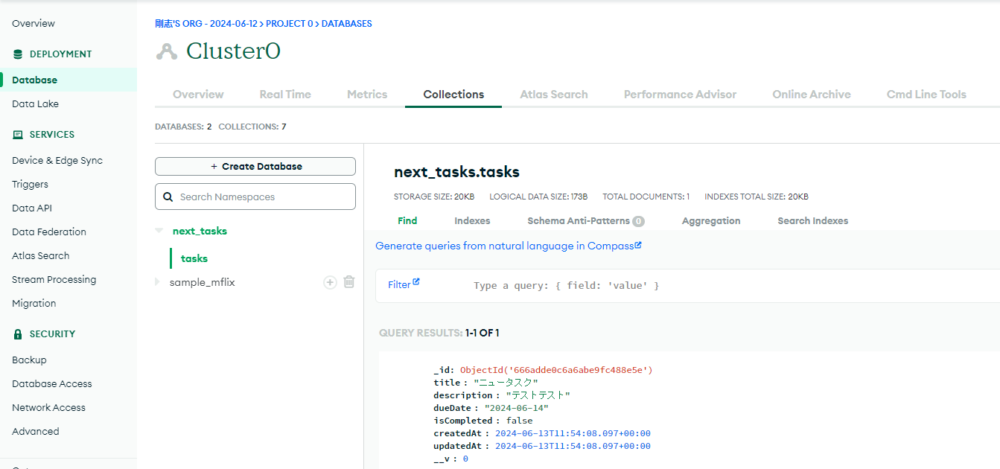

## タスク作成機能の実装
- 実装方法はいくつかあるが、今回はServerActionsを使用する
- srcディレクトリにactionsディレクトリを作成しtask.tsを作成
    - ServerActionsを利用する際にはファイルの先頭に"use server"を記述
    - ServerActions内でエラーが発生した場合に、その内容を返却する為の型を定義する
    ```
    export interface FormState{
    error:string;
    }
    ```
    - タスク作成の関数を非同期関数で定義しこの関数は、FormState型のstateとformから送信されるデータを含むformData型のFormDataを引数とする
    - formdataを基に新規作成するタスクオブジェクトを作成
    - formdataから入力要素を取り出す為には、formData.geet()にformのinputタグのname属性に指定した値を渡す
    - 指定したname属性の値が存在しない場合にはnullが返却されるがここでは必ず存在するとして、as StringでString型を強制する
    - より堅牢なアプリケーションを作成する場合は、ここでzodd？(外部ライブラリ)を使用してバリデーションロジックを追加することもできる
    - isCompletedはタスク作成フォームには存在しないがタスク作成直後は必ず未完了である為、デフォルトでfalseとする

    - trycatchブロックでタスクをデータベースに登録する
    - await connectDb()でデータベース接続を確立しawait TaskModel.create(newTask)で新しいタスクを登録する
    - エラーが発生した場合は、state.error = "タスクの作成に失敗しました";でエラーメッセージを表示しreturn state;でstateを返却する
    - タスクが正常に作成された後は、redirect()に/を渡すことでメイン画面にリダイレクトすることが出来る
    - redirect関数はtrycatchブロックの外で実行する
    ```    
    export const createTask = async (state:FormState,formData:FormData) => {
        const newTask: Task={
            title: formData.get("title") as string,
            description: formData.get("description") as string,
            dueDate: formData.get("dueDate") as string,
            isCompleted:false,
        }
        try {
            await connectDb()
            await TaskModel.create(newTask)
        } catch (error) {
            state.error = "タスクの作成に失敗しました";
            return state;
        }   
        redirect("/")
    }
    ```
    - 以上でタスク作成のServerActionsを定義することが出来る
## ServerActionsを使用してタスク作成機能を実装する
- componentディレクトリにあるNewTaskFormを開き、useFormStateHookを用いて、ServerActionsの戻り値を状態管理するように設定する
    - hookを使用するにはクライアントコンポーネントとして実行する必要がある為、"use client"を追加
    - FormStateの初期状態を定義
    ```
    const initialState:FormState={error:""}
    ```
    - useFormStateにServerActionsであるcreateTask関数とinitialStateを渡す
    - const [state,formAction]でServerActionsの結果とServerActionsと同じ機能を持つformAction関数を取得できる
    ```
    const [state,formAction] = useFormState(createTask,initialState)
    ```
    - 上記のstateを利用してServerActionsでエラーが発生した場合にそのエラーメッセージを表示するようにする
    - formのボタンタグの下に下記を記述
    ```
                {state.error && (<p className="mt-2 text-red-500 text-sm">
                {state.error}
            </p>)}
    ```
    - formタグのaction属性にformActionを渡すことでformの内容がサーバーに送信され、タスクが作成される
    - さらにuseFormStatusフックを用いて、ServerActionsの実行中にはcreateボタンをクリックできないようにする
    - NewTaskFormコンポーネントでは直接useFormStatusを呼び出す事が出来ない為、SubmitButtonとして別のコンポーネントでラップする必要がある
    - const { pending } = useFormStatus();でServerActionsの実行状態を取得
    - disabled属性にpendingを渡し、
    ```
    const SubmitButton = () =>{
        const { pending } = useFormStatus();

        return(
            <button type="submit" className="mt-8 py-2 w-full rounded-md text-white bg-gray-800 hover:bg-gray-700 
            text-sm font-semibold shadow-sm disabled:bg-gray-400" disabled={pending}>
            Create
        </button>
        )
    }
    ```
    - メインページからAddTaskページに遷移し入力を行い、createボタンをクリックしメイン画面にリダイレクトされればタスクの作成に成功
    - MongoDBの管理画面からdatabaseのBrowse Collectionsを開いて下記の通り、入力したタスクがあれば成功
    