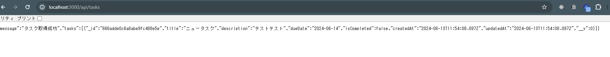

## タスク一覧取得APIの実装
- 作成されたタスク一覧をデータベースから取得する機能を実装
    - タスク一覧を取得するルートハンドラーを実装
    - appディレクトリにapiディレクトリとその中にtasksディレクトリを作成しroute.tsを作成
    - ここにタスク一覧を取得する関数を定義する
    - データ取得の場合は、関数名をGETとする
    - データベースからのデータ取得は失敗する可能性もある為、trycatchブロックで囲む
    - await connectDb();でデータベースとの接続を確立する
    - 全てのタスクを取得するにはfind()を使用する
    - タスク一覧の取得はキャッシュを利用せずリクエスト毎に最新のデータを取得したいので、ファイルの最後にexport const dynamic = "force-dynamic";オプションを追加する
    ```
    import { TaskDocument, TaskModel } from "@/models/task";
    import { connectDb } from "@/utils/database"
    import { NextResponse } from "next/server";
    export const GET = async () =>{
        try {
            await connectDb();
            const allTasks: TaskDocument[]=await TaskModel.find();
            return NextResponse.json({message:"タスク取得成功",tasks:allTasks});
        } catch (error) {
            console.log(error);
            return NextResponse.json({message:"タスク取得失敗"},{status:500});
        }
    };
    export const dynamic = "force-dynamic";
    ```
    - http://localhost:3000/api/tasksにアクセスして下記の画面が出れば、タスク一覧を取得するルートハンドラーは完成となる

    