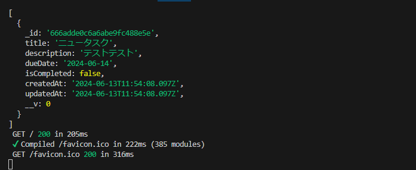
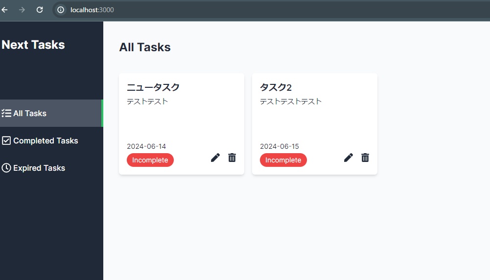

## メインページからタスク一覧の取得
- 前回作成したルートハンドラーを用いて、メインページからタスク一覧を取得する機能を実装
    - (main)グループのpage.tsxを開きルートハンドラーからデータを取得する為の関数を定義する
    - fetch()の第一引数にはAPIのエンドポイントを指定するが、エンドポイントの共通部分は環境変数として管理する
        - .envファイルに下記を記述
        ```
        API_URL=http://localhost:3000/api
        ```
    - fetchの第二引数にはキャッシュのstoreオプションを追加してキャッシュを無効にしておく
    ```
    const getAllTasks = async ():Promise<TaskDocument[]> =>{
      const response = await fetch(`${process.env.API_URL}/tasks`,{
        cache:"no-store",
      });}
    ```
    - 上記でAPiからのレスポンスを受け取れる
    - 下記はリクエストが失敗した場合は、エラーをthrowする
    ```
     if(response.status !==200){
     throw new Error();
    }
    ```
    - リクエストに成功した場合は、const data =await response.json();でデータを取得し、return data.tasks as TaskDocument[];でタスクデータを返却する
    ```
      const data =await response.json();
      return data.tasks as TaskDocument[];
    ```
    - MainPageコンポーネントをasyncで非同期関数にし、  const allTasks = await getAllTasks();でタスク一覧を取得する
    - ブラウザからメインページでリロードを行い、ターミナル上に下記画像のようにデータを取得する事が出来れば、成功
    

## 取得したタスクデータをページに表示する
- componentsディレクトリからTaskCardを開きTaskCardコンポーネントが親コンポーネントからタスクデータを受け取れるように修正する
    - TaskCard.tsxにてTaskCardPropsを定義
    ```
    interface TaskCardProps {
    task: TaskDocument;
    }
    ```
    - TaskCard:React.FC<TaskCardProps> = ({task}) としてtaskを受け取る
    - 次にTaskCard内で仮置きしていた情報を実際のタスクデータで置き換える
    - {task.title},{task.dueDate}など
    - タスク編集ボタンと削除ボタンはid={task._id}を渡す
    ```
    import { TaskDocument } from "@/models/task"
    import TaskDeleteButton from "./TaskDeleteButton/TaskDeleteButton"
    import TaskEditButton from "./TaskEditButton/TaskEditButton"
    interface TaskCardProps {
        task: TaskDocument;
    }
    const TaskCard:React.FC<TaskCardProps> = ({task}) => {
        return (
        <div className="w-64 h-52 p-4 bg-white rounded-md shadow-md flex flex-col justify-between">
            <header>
                <h1 className="text-lg font-semibold">{task.title}</h1>
                <div className="mt-1 text-sm line-clamp-3">{task.description}</div>
            </header>
            <div>
                <div className="text-sm">{task.dueDate}</div>
                <div className="flex justify-between items-center">
                    <div className={`mt-1 text-sm 
                    px-2 py-1 w-24 text-center
                     text-white rounded-full shadow-sm 
                     ${task.isCompleted ? "bg-green-500":"bg-red-500"}`}>
                    {task.isCompleted ? "Completed":"Incomplete"}</div>
                    <div className="flex gap-4">
                        <TaskEditButton id={task._id}/>
                        <TaskDeleteButton id={task._id}/>
                    </div>
                </div>
            </div>
        </div>
      )
    }
    export default TaskCard
    ```
    - TaskCardの修正は完了
    - (main)ページのpage.tsxに戻り、map関数で展開
    - 取得した全てのタスクデータに対して、TaskCardを描画する
    ```
     {allTasks.map((task) => <TaskCard key={task._id} task={task}/>)}
    ```
    - ブラウザからタスクを新規作成するとメインページにリダイレクトされ下記の画像のようになる
    
    