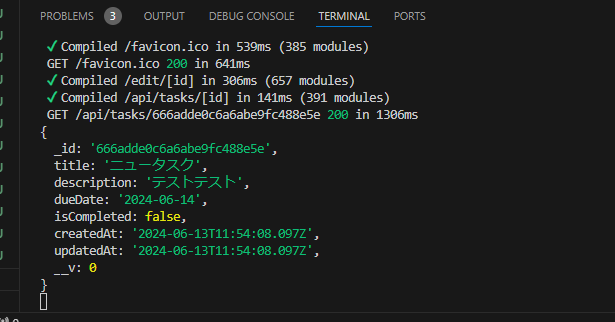

## IDによるタスク取得APIの実装
- IDを用いて、特定のタスクを取得するルートハンドラーを実装する
    - このルートハンドラーはTaskCardの編集ボタンがクリックされた際に呼び出され、取得したタスクデータは編集フォームの初期値として利用する
    - appディレクトリのapi/tasksディレクトリに[id]ディレクトリを作成しroute.tsを作成
    - ルートハンドラーの定義にもページと同じようにダイナミックルートを利用する事が出来る
    - 今回はダイナミックルートなので、[id]を引数で受け取ることが出来る
    - (request:NextRequest)と第一引数にはNextrequest型のrequestを受け取るが、今回は使用しないので、_とする
    - ダイナミックルートのパラメータは第二引数で{params}:{params:{id:string}}とする
    - connectDb()でデータベースとの接続を確立
    - findById()にparams.idを渡すことでidをキーにタスクを検索する
    - タスクが存在しなかった場合
        ```
                if(!task) {
            return NextResponse.json(
                {message:"タスクが存在しません"},
                {status:404}
            );
        }
        ```
    - その他の場合は、タスクを返却する
    ```
        return NextResponse.json({message:"タスク取得成功",task});
    ```
    - データの取得中にエラーが発生した場合は、
    ```
    catch (error) {
        console.log(error);
        return NextResponse.json({message:"タスク取得失敗"},{status:500})
    }
    ```
    - 上記を返却する
    - 最後にリクエスト毎に実行されるように下記を記述
    ```
    export const dynamic ="force-dynamic"
    ```
##　タスク編集ページでこのルートハンドラーを呼び出す
- (main)/edit/[id]/page.tsxを開く
    - 環境変数から取得したAPI_URLとtaskの{id}を組み合わせたエンドポイントに対してリクエストを送信する
    - キャッシュは使用しないので第二引数で cache:"no-store",を追加しておく
    ```
    const getTask = async (id:string):Promise<TaskDocument> =>{
    const response = await fetch(`${process.env.API_URL}/tasks/${id}`,{
        cache:"no-store",
    });}
    ```
    - 取得したタスクデータを返却する
    ```
    const data = await response.json();
    return data.task as TaskDocument;
    ```
    - EditTaskPageコンポーネントを非同期にし、タスクデータを取得する
    ```
    const id = params.id;
    const task = await getTask(id);
    ```
    - ブラウザからメインページでタスクカードの編集ボタンをクリックしターミナルに下記画像のようにデータを確認できれば成功
    

    
