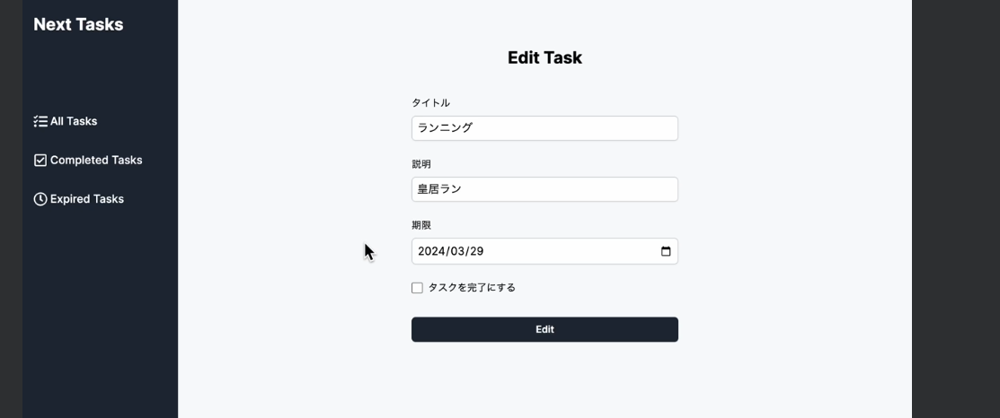
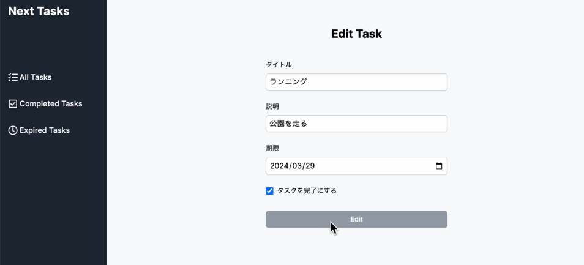

## タスク編集機能の実装
- 取得したタスクデータを用いて、タスクの編集機能を実装する
    - (main)/edit/[id]/page.tsxのタスク編集ページで取得したタスクデータをEditTaskFormに渡す
    ```
    <EditTaskForm task={task}/>
    ```
    - EditTaskFormがタスクデータを受け取る設定になっていない為、修正する
    - TaskDocumentを定義し、EditTaskFormの型をconst EditTaskForm: React.FC<EditTaskFormProps> = ({ task }) で指定し、受け取ったtaskデータをformの初期値として利用する為、useState()を使用する
    - その為、ファイルの先頭に"use client"を追加しクライアントコンポーネントに変更しておく
    - 下記のように各フィールドのstateを定義する
    ```
      const [title, setTitle] = useState(task.title);
      const [description, setDescription] = useState(task.description);
      const [dueDate, setDueDate] = useState(task.dueDate);
      const [isCompleted, setIsCompleted] = useState(task.isCompleted);
    ```
    - それぞれのstateとset関数をinput要素に渡す
    - 下記はタイトルのinput要素でvalue={title}onChange={(e) => setTitle(e.target.value)}を追加
    ```
          <input
            type="text"
            id="title"
            name="title"
            value={title}
            onChange={(e) => setTitle(e.target.value)}
            required
            className="block mt-2 py-1.5 px-2 w-full rounded-md border-0 
          shadow-sm ring-1 ring-inset ring-gray-300"
          />
    ```
    - この状態でタスク編集フォームを確認すると取得したタスクの情報がフォームのinput要素に反映されていることが確認できる
    

## タスクの更新処理を行うためのServerActionsを定義する
- actionディレクトリのtask.tsでupdatetask関数を作成する
    - update関数ではstateとformdataに加えて更新するtaskのIDも受け取る必要がある為、第一引数にid:stringを追加
    - タスクの更新処理には、await TaskModel.updateOne({ _id: id }, updateTask);で第一引数には更新条件のidを指定し、第二引数には更新するデータであるupdateTaskを渡す
    - 更新条件のidはMongoDBのidである為、_が付く

    ```
    export const updateTask = async (
      id: string,
      state: FormState,
      formData: FormData
    ) => {
      const updateTask: Task = {
        title: formData.get('title') as string,
        description: formData.get('description') as string,
        dueDate: formData.get('dueDate') as string,
        isCompleted: Boolean(formData.get('isCompleted')),
      };
      try {
        await connectDb();
        await TaskModel.updateOne({ _id: id }, updateTask);
      } catch (error) {
        state.error = 'タスクの更新に失敗しました';
        return state;
      }

      redirect('/');
    };
    ```
## 更新処理
- formに存在しないタスクのidをServerActionに渡す為にbind()を使用する
    - EditTaskForm.tsxで下記を記述
    - task_idを引数とするupdateTask関数の新しいインスタンスを作成する
    ```
     const updateTaskWithId = updateTask.bind(null, task._id);
    ```
    - ServerActionsの戻り値の初期状態を記述
    ```
     const initialState: FormState = { error: '' };
    ```
    - useFormStateHooksを用いて、ServerActionsの実行結果をstateに保持する
    ```
      const [state, formAction] = useFormState(updateTaskWithId, initialState);
    ```
    - formActionをformのaction属性に設定
    ```
    <form action={formAction}>
    ```
    - さらにServerActionsの実行状態を取得する為、SubmitButtonコンポーネントを作成
    - useFormStatusからpendingを取得しdisabledを追加し、ServerActionsの実行中はボタンを無効化する
    - 
    ```
      const SubmitButton = () => {
        const { pending } = useFormStatus();

        return (
          <button
            type="submit"
            disabled={pending}
            className="mt-8 py-2 w-full rounded-md text-white 
            bg-gray-800 hover:bg-gray-700 text-sm font-semibold shadow-sm
            disabled:bg-gray-400"
          >
            Edit
          </button>
        );
      };
    ```
    - SubmitButtonを配置し、その下にエラーが発生した場合にエラーメッセージを表示するように記述する
    ```
            <SubmitButton />
        {state.error !== '' && (
          <p className="mt-2 text-red-500 text-sm">{state.error}</p>
        )}
    ```
    - ブラウザからタスク編集フォームの編集が行えると成功
    