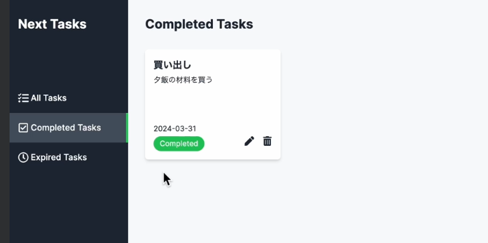

## 完了タスクページの実装
- 完了タスクを取得するためのルートハンドラーを設定する
    - app/api/tasks/の中にcompletedディレクトリを作成しその中にroutex.tsを作成
    - find()に検索条件としてisCompleted:trueを渡し完了状態がtrueのタスクのみを取得するようにする
    - 結果を格納する変数名をcompletedTasksとする
    ```
    import { TaskDocument, TaskModel } from '@/models/task';
    import { connectDb } from '@/utils/database';
    import { NextResponse } from 'next/server';
    export const GET = async () => {
      try {
        await connectDb();
        const completedTasks: TaskDocument[] = await TaskModel.find({
          isCompleted: true,
        });

        return NextResponse.json({ message: 'タスク取得成功', tasks: completedTasks });
      } catch (error) {
        console.log(error);
        return NextResponse.json({ message: 'タスク取得失敗' }, { status: 500 });
      }
    };
    export const dynamic = 'force-dynamic';
    ```
    - ルートハンドラーは完成
    - (main)/completed/page.tsxを開き、ルートハンドラーを呼び出して、取得したタスクデータをTaskCardコンポーネントに渡す
    - getCompletedTasks関数を作成
    - ${process.env.API_URL}/tasks/completed`で完了タスク取得APIにリクエストを送信するように変更する
    ```
    const getCompletedTasks = async (): Promise<TaskDocument[]> => {    
      const response = await fetch(`${process.env.API_URL}/tasks/completed`, {
        cache: 'no-store',
      });

      if (response.status !== 200) {
        throw new Error();
      }

      const data = await response.json();
      return data.tasks as TaskDocument[];
    };
    ```
    - CompletedTaskPageコンポーネントを非同期にして、完了済タスクを取得する
    ```
    const completedTasks = await getCompletedTasks();
    ```
    - ここで取得したデータをmap関数で展開する
    ```
            {completedTasks.map((task) => (
          <TaskCard key={task._id} task={task} />
        ))}
    ```
    - 完成画面
    