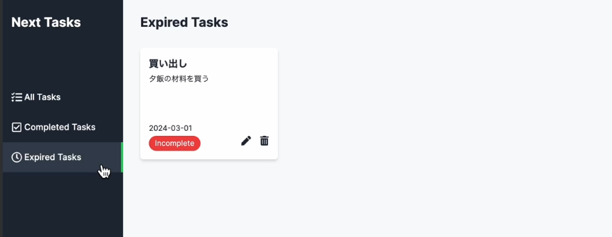

## 期限切れタスクページの実装
- api/tasksディレクトリにexpiredディレクトリを作成しroute.tsを作成
    - 今回扱う期限切れタスクとは、タスクが未完了であることとタスクの期限が現在の日付より小さいことという2つの条件を満たすものと定義する
    - タスクが未完了であるという条件はisCompleted:をfalseとするだけ
    ```
        const completedTasks: TaskDocument[] = await TaskModel.find({
      isCompleted: false,
      dueDate: { $lt: currentDate },
    });
    ```
    - タスクの期限を現在の日付と比較する
    - new Dateで取得した現在時刻を日本時間のyyyy/mm/ddの形式に変換する処理
    ```
      const currentDate = new Date().toLocaleDateString('ja-JP', {
        year: 'numeric',
        month: '2-digit',
        day: '2-digit',
      }).replace(/\//g, '-');
    ```
    - find()に下記を記述
    - $ltはMongoDBでより小さい条件を指定する為の演算子となる
    ```
    dueDate: { $lt: currentDate },
    ```
    - これで期限切れタスクのルートハンドラーが完成
    - (main)/expired/page.tsxを編集
    - getExpiredTasks関数を作成
    ```     
    const getExpiredTasks = async (): Promise<TaskDocument[]> => {
      const response = await fetch(`${process.env.API_URL}/tasks/expired`, {
        cache: 'no-store',
      });

      if (response.status !== 200) {
        throw new Error();
      }

      const data = await response.json();
      return data.tasks as TaskDocument[];
    };
    ```
    - ExpiredTaskPageをasyncにし期限切れタスクを取得
    ```
      const expiredTasks = await getExpiredTasks();
    ```
    - map関数で展開
    ```
            {expiredTasks.map((task) => (
          <TaskCard key={task._id} task={task} />
        ))}
    ```
    - ブラウザで期限切れタスクページにアクセスすると下記の画像のようになる
    