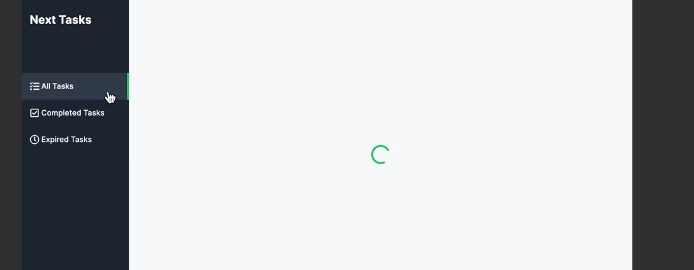

## ローディングコンポーネントの実装
- (main)グループの直下にloading.tsxを作成
```
const loading = () => {
    return (
      <div
        className="h-full flex justify-center items-center"
        aria-label="読み込み中"
      >
        <div
          className="animate-spin h-10 w-10 border-4 border-green-500
        rounded-full border-t-transparent"
        ></div>
      </div>
    );
  };
  
  export default loading;
```
- 完成イメージ図
