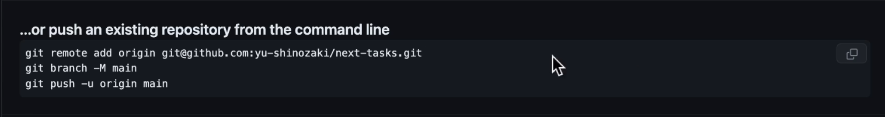
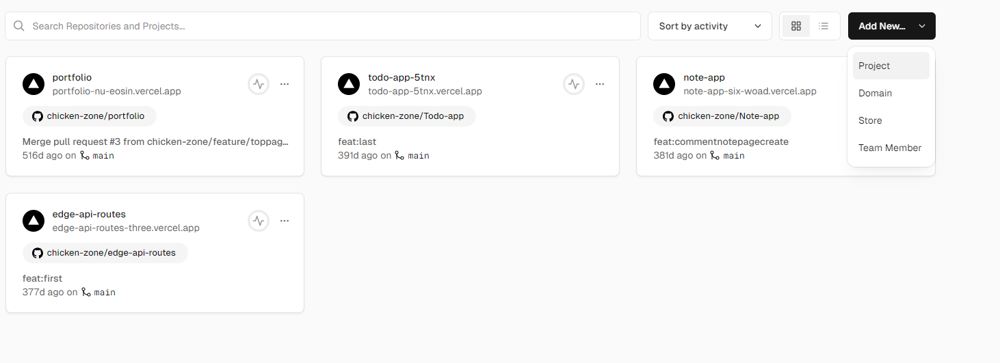
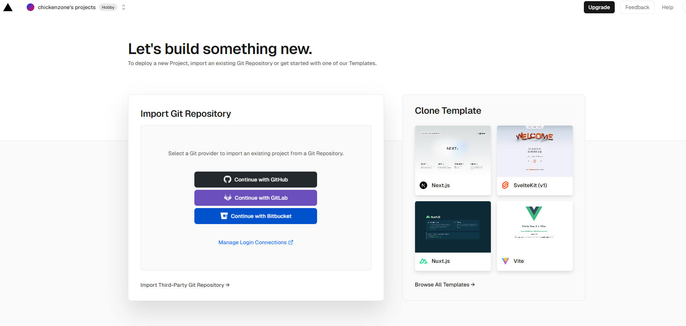
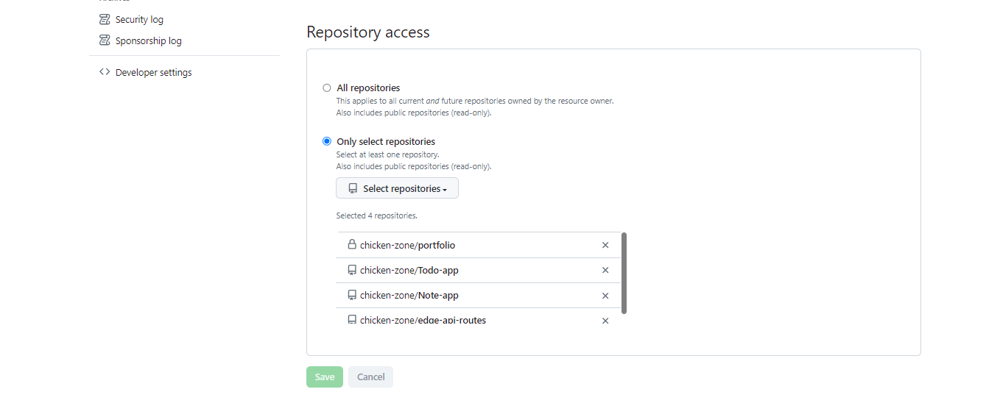

## Vercelデプロイ方法
- VerceklにデプロイするにはGitHubを使ってコードを管理しておく必要がある
- Githubpushを行う
- git add .を行い、git commit -m"コミットメッセージ"、下記のコマンドを実行すればリポジトリにpush出来る

## next-tasksプロジェクトをデプロイ
- Vercelにログイン

- addNew projectをクリック

- ここでは権限をまだ付与していない為、Vercelに権限を与える設定をGithub上で行う

- importボタンをクリックしデプロイの設定を行う
- 基本的にはVercelがGithubリポジトリの内容を読み込んで自動的に最適な設定を行ってくれる
- 今回は.envファイルをGit管理対象外としている為、環境変数の設定を追加で行う必要がある
- 現時点ではAPi_URLに設定するドメイン名がわからないのでこのままデプロイする
