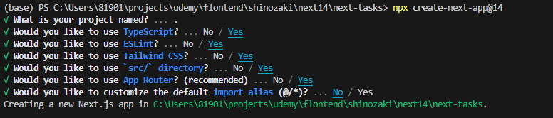
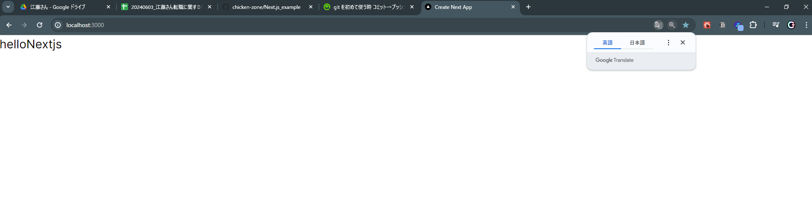

## インストール
- 1.```npx create-next-app@14```
    - 下記の図の用に設定
    
- 2.不要なファイルや設定を削除
    - globals.cssの中身を下記に変更
    ```
    @tailwind base;
    @tailwind components;
    @tailwind utilities;
    ```
    - appディレクトリ直下page.tsxを下記に変更
    ```
    export default function Home() {
      return (
        <div>helloNextjs</div>
      );
    }
    ```
    - npm run devを実行し下記のブラウザが立ち上がれば、準備完了
    
  
## ReactIconLibrary
```
npm install react-icons --save

型定義
npm i -D @types/react-icons

```