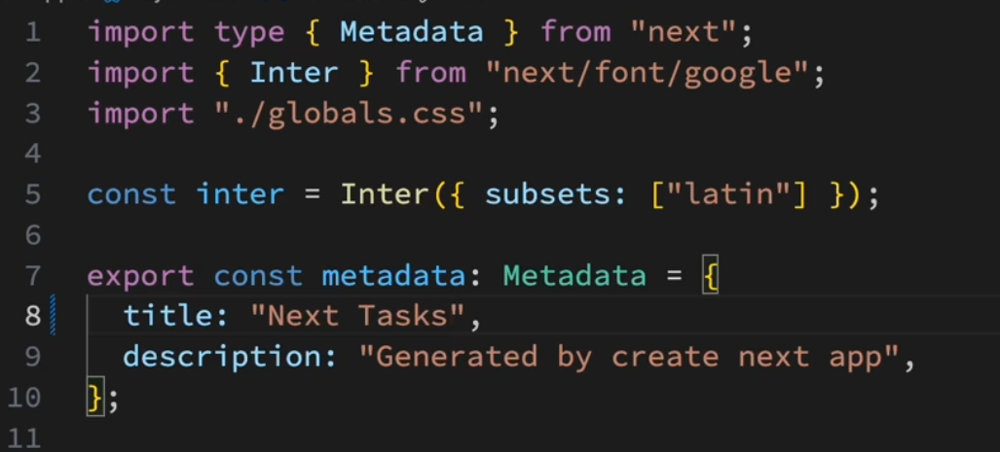

##　共通レイアウトの作成
- 今回開発するタスク管理アプリはサイドメニューとメイン画面から構成され、サイドメニューはメインページだけでなく複数のページで共通して使用される為、共通レイアウトを作成することで効率的に開発を進めることが出来る

- 1.appディレクトリ内のlayout.tsxでMetadataのtitleをNext Tasksに変更する
    - これによりこのレイアウトが適用されるページでは共通のタイトルが設定される
    
- 2.appディレクトリに(main)ディレクトリを作成しその中にappディレクトリ直下のpage.tsxを移動させる
- 3.Next.jsではルートグループ毎に共通レイアウトを作成する事が出来る為、(main)ディレクトリ内にlayout.tsxを作成
- 4.引数のchildrenをappディレクトリ直下のlayout.tsxからコピぺ
- 5.MainLayoutの中にサイドメニューとメインの{children}を追加してレイアウトの基本構造を作成
- 6.一番外側のdivタグにflexを追加して横並びにし、bgで背景色を変更
- 7.各要素の高さがテキスト分しかない為、h-screenで画面の高さいっぱいに表示されるようにする
- 8.さらにメイン部分を余白いっぱいに広げる為に、flex-1を追加しタスクが多くなった際にスクロールできるようにoverflow-autoを追加
    ```
    const MainLayout = ({
        children,
      }: Readonly<{
        children: React.ReactNode;
      }>) => {
      return (
        <div className="flex h-screen ">
            <div className="bg-indigo-300">サイドメニュー</div>
            <main className="bg-red-300 flex-1 overflow-auto">{children}</main>
        </div>
      )
    }
    export default MainLayout
    ```
- 上記で共通レイアウト完成