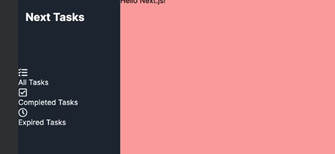

## sidemenuの基本的なデザインを作成
- 1.srcディレクトリにcomponentsディレクトリを作成しSideMenuディレクトリを作成さらにSideMenu.tsxを作成する
    - appディレクトリの中にコンポーネントを作成することもできるが、今回は可読性の観点からページ以外のコンポーネントはディレクトリの外に配置する
- 2.前回配置した(main)グループのlayout.tsx内にSideMenuコンポーネントを配置
    ```
    import SideMenu from "@/components/SideMenu/SideMenu";
    const MainLayout = ({
        children,
      }: Readonly<{
        children: React.ReactNode;
      }>) => {
    return (
        <div className="flex h-screen ">
            <SideMenu/>
            <main className="bg-red-300 flex-1 overflow-auto">{children}</main>
        </div>
    )
    }
    export default MainLayout
    ```
- 3.SideMenuコンポーネントのデザインを行う
    - SideMenuディレクトリ内にNavListディレクトリを作成しNavList.tsxを作成
    ```
    const NavList = () => {
      return (
        <div>
            <div>Link1</div>
            <div>Link2</div>
            <div>Link3</div>
        </div>
      )
    }
    export default NavList
    ```
    - SideMenuコンポーネントにNavListコンポーネントを配置
        - NavList.tsxにリストに表示するナビゲーションアイテムの型を定義
        ```
        interface NavItemType{
            id:number;
            label:string;
            link:string;
            icon:React.ReactNode;
        }
        ```
        - NavItemType型のナビゲーションリストを定義
        ```
        const navList:NavItemType[]=[]
        ```
        - npm install react-icons --saveでReactIconsをインストール
            - npm i -D @types/react-iconsで型定義もインストール
        - NavList.tsx内を下記のように記述
        ```
        import { FaRegCheckSquare, FaRegClock, FaTasks } from "react-icons/fa";

        interface NavItemType{
            id:number;
            label:string;
            link:string;
            icon:React.ReactNode;
        }
        const NavList = () => {
            const navList:NavItemType[]=[
                {id: 1,label:"All Tasks",link:"/",icon:<FaTasks className="size-5"/>},
                {id: 2,label:"Completed Tasks",link:"/completed",icon:<FaRegCheckSquare className="size-5"/>},
                {id: 3,label:"Expired Tasks",link:"/expired",icon:<FaRegClock className="size-5"/>},
                ]
            return (
                <div className="mt-24">
                    <div>Link1</div>
                    <div>Link2</div>
                    <div>Link3</div>
                </div>
              )
        }
        export default NavList
        ```
## サイドメニューの基本的なデザインが完成

## 詳細なサイドメニューを実装
- ナビゲーションのリンク部分を作成
    - NavListディレクトリ内にNavItemディレクトリを作成しNavItem.tsxを作成
        - このコンポーネントはNavListからナビゲーション要素を受け取る為propsとして下記を記述
        ```
        interface NavItemProps{
            label:string;
            link:string;
            icon:React.ReactNode;
        }
        ```
        - NavItemにReact.FC<NavItemProps>として型を指定し、引数で ({label,link,icon}) を受け取る
        - 上記の引数をを用いて、Next/linkのLinkタグを使用しlinkを渡す
        - iconとlabelも表示する
        ```
        import Link from "next/link";
        interface NavItemProps{
            label:string;
            link:string;
            icon:React.ReactNode;
        }
        const NavItem:React.FC<NavItemProps> = ({label,link,icon}) => {
            return (
                <Link href={link}>
                <div>{icon}</div>
                <div>{label}</div>
            </Link>
              )
        }
        export default NavItem
        ```
        - NavList.tsxから読み込んで内容を確認する為に、ダミーのdivタグで包んだLinkを削除しmap関数で展開する為に、ナビゲーションリストの各要素をNavItemコンポーネントに渡す
        - 下記はNavList.tsxのreturn部分のみ抜粋
        ```
          return (
            <div className="mt-24">
                {navList.map((item) =>(
                    <NavItem key={item.id} label={item.label} link={item.link} icon={item.icon}/>
                ))}
            </div>)
        ```
        
        - デザイン調整を行う為、NavItem.tsxにcssを記述
        - Linkタグのみ抜粋
        ```
        <Link href={link} className="flex p-4 items-center w-full hover:bg-gray-700 font-medium">
            <div>{icon}</div>
            <div>{label}</div>
        </Link>
        ```
    - 現在のページのリンクをアクティブ表示する
        - 現在のページを取得するには、NavItem.tsx内にusePathnameフックを使用
        - usePathnameはnext/navigationからインポートしたものでhooksとなる為、"use client"をファイルの先頭につけクライアントコンポーネントにする必要がある
        - このusePathnameから取得した現在のページのパスであるpathnameとlinkが等しい場合にアクティブと判定する
        - classname内で変数を扱う場合は、{``}で囲む必要がある
        - ${pathname === link ? "bg-gray-600 border-r-4 border-r-green-500":""}でアクティブなページのリンクを明るくし、右側に緑色のボーダーをつける
        ```
        "use client";

        import Link from "next/link";
        import { usePathname } from "next/navigation";

        interface NavItemProps{
            label:string;
            link:string;
            icon:React.ReactNode;
        }
        const NavItem:React.FC<NavItemProps> = ({label,link,icon}) => {
            const pathname = usePathname()
                return (
                    <Link href={link} className={`flex p-4 items-center w-full hover:bg-gray-700 font-medium
                    ${pathname === link ? "bg-gray-600 border-r-4 border-r-green-500":""}`}>
                        <div className="mr-1">{icon}</div>
                        <div>{label}</div>
                    </Link>
                  )
        }

        export default NavItem
        ```

        - 下記の画像のようになる
        
## 以上でサイドメニューの実装は完了となる
