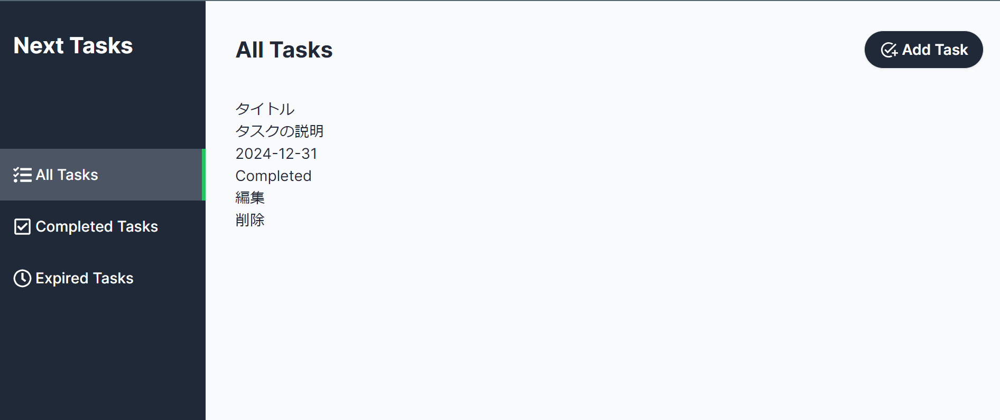

## taskcardの実装
- componentディレクトリにTaskCardディレクトリを作成
    - TaskCard.tsxを作成
    - TaskCardコンポーネントでは最終的には親コンポーネントから渡されたタスク情報を利用するようにするが、仮実装としてダミーの値を使用して実装する
        ```
        const TaskCard = () => {
          return (
            <div>
                <header>
                    <h1>タイトル</h1>
                    <div>タスクの説明</div>
                </header>
            <div>
                <div>2024-12-31</div>
            <div>
                <div>{true ? "Completed":"Incomplete"}</div>
                 <div>
                    <div>編集</div>
                    <div>削除</div>
                 </div>
                </div>
            </div>
        </div>
          )
        }
        export default TaskCard
        ```
    - (main)ページにTaskCardコンポーネントを配置し下記の画面になれば、デザイン調整をかける
    

- デザイン調整
    - line-clamp-3は長い文字列の場合に一定の長さで切り詰め３点リーダーで表示するプロパティ
    ```
        const TaskCard = () => {
          return (
            <div className="w-64 h-52 p-4 bg-white rounded-md shadow-md flex flex-col justify-between">
                    <header>
                        <h1 className="text-lg font-semibold">タイトル</h1>
                        <div className="mt-1 text-sm line-clamp-3">タスクの説明</div>
                    </header>
                    <div>
                        <div className="text-sm">2024-12-31</div>
                        <div className="flex justify-between items-center">
                        <div className={`mt-1 text-sm 
                        px-2 py-1 w-24 text-center
                         text-white rounded-full shadow-sm 
                         ${true ? "bg-green-500":"bg-red-500"}`}>
                        {true ? "Completed":"Incomplete"}</div>
                        <div className="flex gap-4">
                    <div>編集</div>
                    <div>削除</div>
                        </div>
                    </div>
                </div>
            </div>
          )
        }
        export default TaskCard
    ```
- 編集ボタンの作成
    - TaskEditButtonディレクトリとTaskEditButton.tsxを作成
        - このコンポーネントは親コンポーネントから受け取ったtaskIdを使用して、対応するタスクの編集ページへ遷移する機能を持つ
    - id部分を動的にしてページ遷移を行う
    ```
    import Link from "next/link";
    import { FaPen } from "react-icons/fa";
    interface TaskEditButtonProps {
        id:string;
    }

    const TaskEditButton:React.FC<TaskEditButtonProps> = ({id}) => {
        return (
            <Link href={`/edit/${id}`}>
                <FaPen className="hover:text-gray-700 text-lg cursor-pointer"/>
            </Link>
        )
    }
    export default TaskEditButton
    ```
    - TaskCard.tsxの編集ボタンに置き換える
    - idを付与
    ```
    <TaskEditButton id="1"/>
    ```
    

- 削除ボタンの作成
    - 削除ボタンではserverActionsを使用してタスク削除機能を実装する為、formタグを使用する
    - TaskDeleteButtonのディレクトリとTaskDeleteButton.tsxを作成
    下記を記述
    ```
    import { FaTrashAlt } from "react-icons/fa";

    interface TaskDeleteButtonProps{
        id:string;
    }
    const TaskDeleteButton:React.FC<TaskDeleteButtonProps> = ({id}) => {
        return (
            <form action="">
                <button type="submit" className="hover:text-gray-700 text-lg cursor-pointer">
                <FaTrashAlt/>
                </button>
            </form>
          )
    }
    export default TaskDeleteButton
    ```
    - TaskCard.tsxの削除ボタンに置き換える
    - idを付与
    