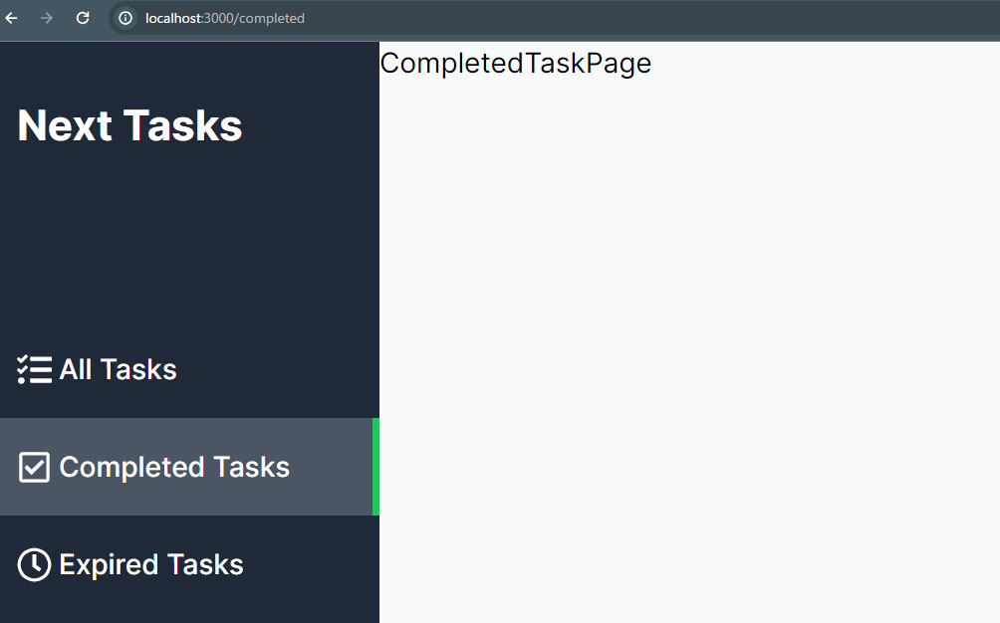
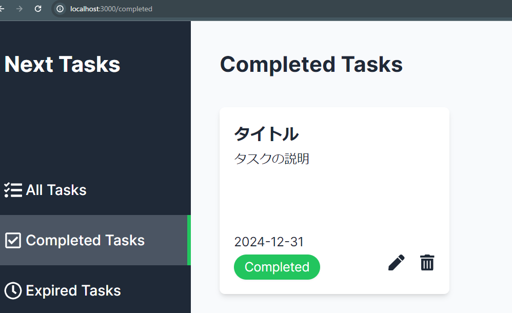
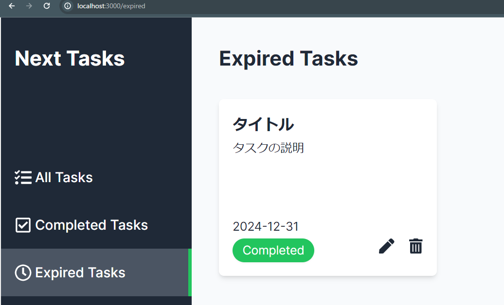
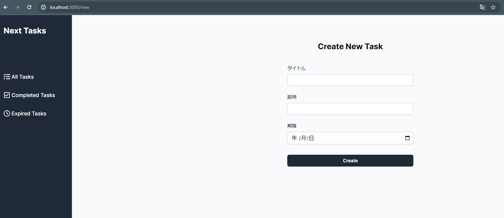
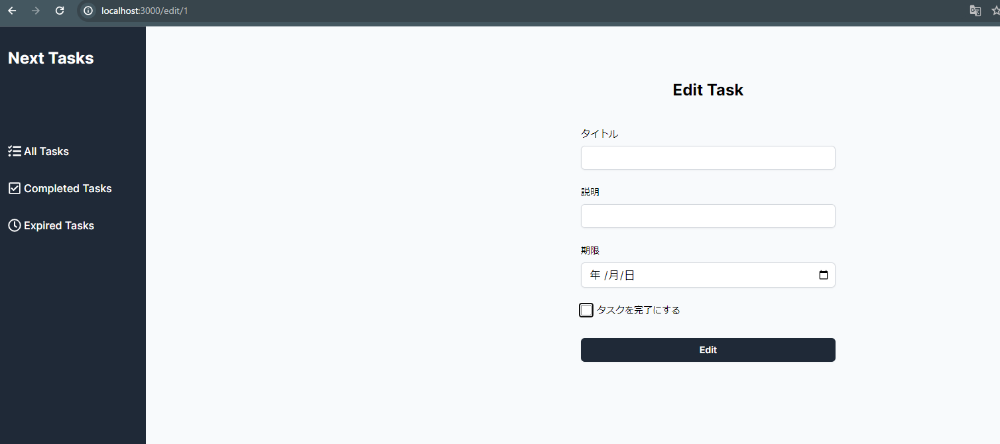

## 完了タスクページと期限切れタスクページの実装
- 完了タスクページではパスを/completedとしたいので(main)ディレクトリ内にcompletedディレクトリとpage.tsxを作成

上記のようにルーティングとアクティブ状態が正しく機能されていることが確認できる
- (main)ディレクトリのpage.tsxから中身をコピーし下記のように修正
    - タスク作成リンクはメインページにのみ配置したい為、リンクタグは削除
    - titleはc
    ```
    import TaskCard from "@/components/TaskCard/TaskCard";
    const CompletedTaskPage = () => {
      return (
            <div className="text-gray-800 p-8 h-full overflow-y-auto pb-24">
                <header className="flex justify-between items-center">
                    <h1 className="text-2xl font-bold flex items-center">Completed Tasks</h1>
                </header>
                <div className="mt-8 flex flex-wrap gap-4">
                    <TaskCard/>
                </div>
            </div>
          );
    }
    export default CompletedTaskPage
    ```
    

- 期限切れタスクページの作成
    - (main)ディレクトリにexpiredディレクトリを作成しその中にcompleted内のpage.tsxをコピー
    - コンポーネント名とh1タグを修正
    ```
    import TaskCard from "@/components/TaskCard/TaskCard";
    const ExpiredTaskPage = () => {
        return (
            <div className="text-gray-800 p-8 h-full overflow-y-auto pb-24">
              <header className="flex justify-between items-center">
                <h1 className="text-2xl font-bold flex items-center">Expired Tasks</h1>
              </header>
              <div className="mt-8 flex flex-wrap gap-4">
                <TaskCard/>
              </div>
            </div>
          );
    }
    export default ExpiredTaskPage
    ```
    
    - 期限切れタスクページのも正しくルーティング等の機能が動作出来ていることが確認できる

## タスク作成ページの実装
- このページはメインページにあるAddTaskボタンからアクセスするページとなる
- パスは/newとする
    - (main)ディレクトリ内にnewディレクトリとpage.tsxを作成しNewTaskPageを作成
    - これによりAdd TaskボタンからNewTaskPageへの遷移が可能となる
    - 下記を記述
    - form部分はコンポーネントとして切り出す為にcomponentsディレクトリにNewTaskFormディレクトリとNewTaskForm.tsxを作成
```
const NewTaskForm = () => {
  return (
    <div className="mt-10 mx-auto w-full max-w-sm">
        <form action="">
            <div>
                <label htmlFor="title" className="block text-sm font-medium">タイトル</label>
                <input type="text" id="title" name="title" required
                className="block mt-2 py-1.5 px-2 w-full rounded-md border-0
                shadow-sm ring-1 ring-inset ring-gray-300" />
            </div>
            <div className="mt-6">
                <label htmlFor="description" className="block text-sm font-medium">説明</label>
                <input type="text" id="description" name="description" required
                className="block mt-2 py-1.5 px-2 w-full rounded-md border-0
                shadow-sm ring-1 ring-inset ring-gray-300" />
            </div>
            <div className="mt-6">
                <label htmlFor="dueDate" className="block text-sm font-medium">期限</label>
                <input type="date" id="dueDate" name="dueDate" min="2020-01-01" max="2999-12-31" required
                className="block mt-2 py-1.5 px-2 w-full rounded-md border-0
                shadow-sm ring-1 ring-inset ring-gray-300" />
            </div>
            <button type="submit" className="mt-8 py-2 w-full rounded-md text-white bg-gray-800 hover:bg-gray-700 text-sm font-semibold shadow-sm">
                Create
            </button>
        </form>
    </div>
  )
}

export default NewTaskForm
```



## タスク編集ページの実装
- タスク編集ページはタスク作成ページとほぼ同様だが、パスに編集したいタスクのIDを動的に含める必要がある
- このような動的ルーティングを設定するには、Next.jsの動的ルーティング機能を利用する
    - (main)ディレクトリ内にeditディレクトリを作成し[id]ディレクトリを作成、page.tsxを作成しEditTaskPageコンポーネントを定義する
        - []を使用したディレクトリ名はパスの一部が動的に変化する事を示す
        - []の中身であるidはパラメータとして取得することができる
        - パスのID部分をパラメータとして取得するには、パラメータの型をinterfaceで定義し、コンポーネントの引数でparamsを受け取る
        - {params}:Paramsの{params}に[id]が含まれているので、const id = params.id;で取得できる
        - 
        ```
        import EditTaskForm from "@/components/EditTaskForm/EditTaskForm";
        interface Params {
            params: {id:string};
        }
        const EditTaskPage = ({params}:Params) => {
            // const id = params.id;
            return (
                <div className="flex flex-col justify-center py-20">
                    <h2 className="text-center text-2xl font-bold">Edit Task</h2>
                    <EditTaskForm/>
                </div>
              )
        }
        export default EditTaskPage
        ```
        - componentsディレクトリにEditTaskFormディレクトリを作成しEditTaskForm.tsxも作成
        - EditTaskFormではタスク完了ステータスも編集したい為、期限の入力要素の下に完了ステータスのチェックボックスを追加
        ```       
        const EditTaskForm = () => {
            return (
                <div className="mt-10 mx-auto w-full max-w-sm">
                    <form action="">
                        <div>
                            <label htmlFor="title" className="block text-sm font-medium">タイトル</label>
                            <input type="text" id="title" name="title" required
                            className="block mt-2 py-1.5 px-2 w-full rounded-md border-0
                            shadow-sm ring-1 ring-inset ring-gray-300" />
                        </div>
                        <div className="mt-6">
                            <label htmlFor="description" className="block text-sm font-medium">説明</label>
                            <input type="text" id="description" name="description" required
                            className="block mt-2 py-1.5 px-2 w-full rounded-md border-0
                            shadow-sm ring-1 ring-inset ring-gray-300" />
                        </div>
                        <div className="mt-6">
                            <label htmlFor="dueDate" className="block text-sm font-medium">期限</label>
                            <input type="date" id="dueDate" name="dueDate" min="2020-01-01" max="2999-12-31" required
                            className="block mt-2 py-1.5 px-2 w-full rounded-md border-0
                            shadow-sm ring-1 ring-inset ring-gray-300" />
                        </div>
                        <div className="mt-6 flex items-center">
                            <input type="checkbox" id="isCompleted" name="isCompleted"
                            className="mr-2 w-4 h-4" />
                            <label htmlFor="isCompleted" className="text-sm">タスクを完了にする</label>
                        </div>
                        <button type="submit" className="mt-8 py-2 w-full rounded-md text-white bg-gray-800 hover:bg-gray-700 text-sm font-semibold shadow-sm">
                            Edit
                        </button>
                    </form>
                </div>
              )
        }
        export default EditTaskForm
        ```
        