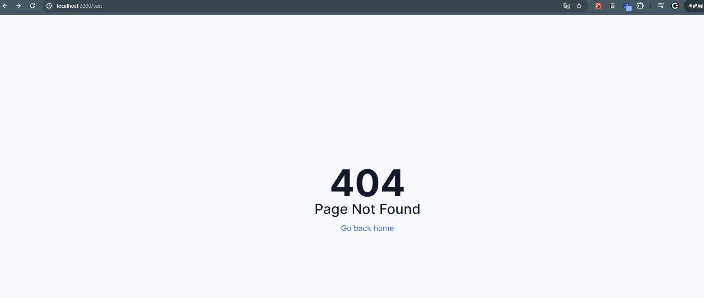
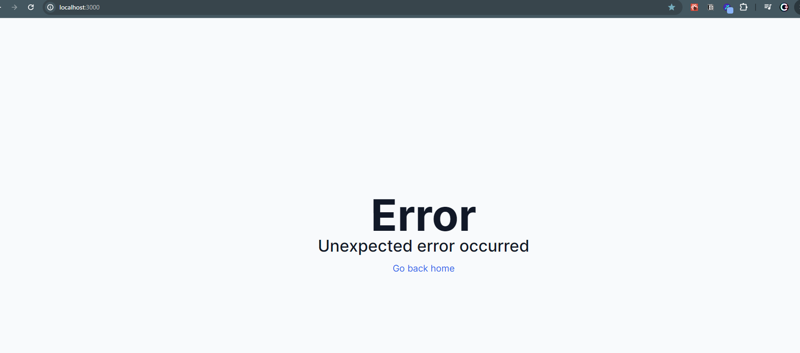

## NotFoundページの作成
- appディレクトリ内にnot-found.tsxを作成
    ```
    import Link from "next/link"
    const NotFoundPage = () => {
        return (
            <div className="h-screen flex flex-col justify-center items-center bg-slate-50 text-gray-900">
                <h1 className="text-8xl font-bold">404</h1>
                <p className="text-4xl font-medium">Page Not Found</p>
                <Link href="/" className="mt-4 text-xl text-blue-600 hover:underline">Go back home</Link>
            </div>
          )
        }
    export default NotFoundPage
    ```
    - /testなど存在しないパスにアクセスすると下記のページが表示されるようになる
    
    
##　エラーページの作成
- appディレクトリ内にerror.tsxを作成
    - ErrorPageコンポーネントはクライアントコンポーネントである必要がある為、"use client"を記述
    ```
    "use client"
    import Link from "next/link"
    const ErrorPage = () => {
    return (
        <div className="h-screen flex flex-col justify-center items-center bg-slate-50 text-gray-900">
            <h1 className="text-8xl font-bold">Error</h1>
            <p className="text-4xl font-medium">Unexpected error occurred</p>
            <Link href="/" className="mt-4 text-xl text-blue-600 hover:underline">Go back home</Link>
        </div>
      )
    }
    export default ErrorPage
    ```
    