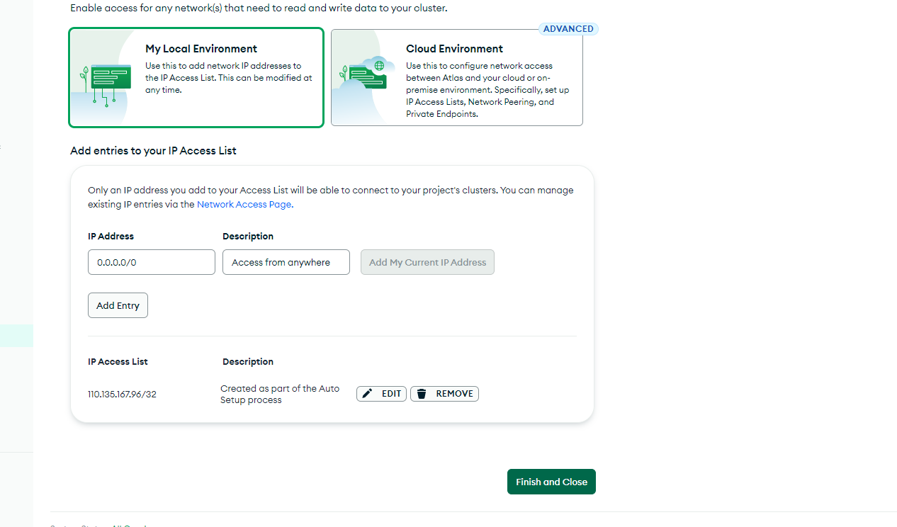
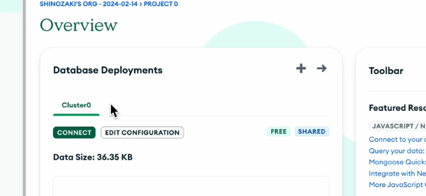
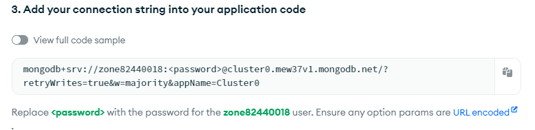
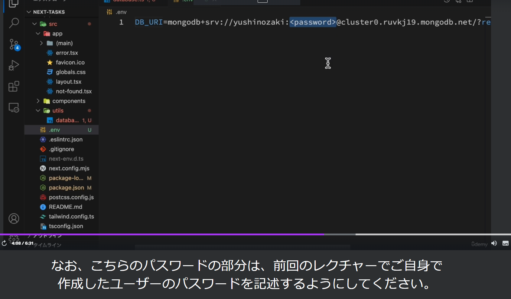
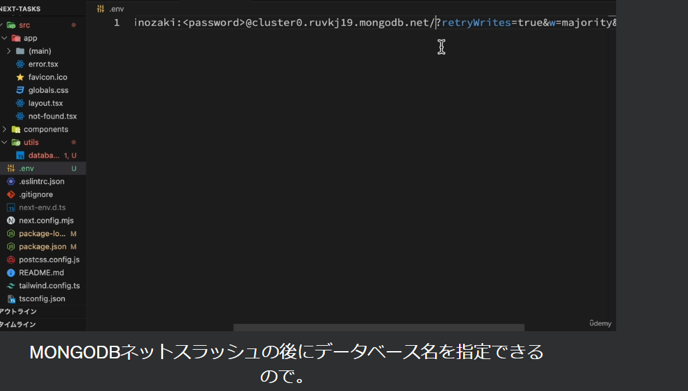

## タスクのCRUD機能の実装
- CRUDとは=>create Read update deleteの頭文字をとった用語で、具体的にはタスクの作成、取得、更新、削除機能を実装する
- MongoDBは、柔軟性とスケーラビリティが高く、多くのアプリケーションで採用されている

- MongoDBのセットアップ
    - URL https://www.mongodb.com/ja-jp
    - tryfreeからサインアップを行い、アンケートに回答
    - 使用するデータベースの設定
    - 無料の範囲内で使用するには、M0フリーを選択それ以外は、デフォルトのまま作成
    - passwordはnotionに記載
    - ネットワーク関連の設定
    - Add entryで作成し、今回はどこからでもアクセスできる設定をしているが、アプリによっては適宜状況に応じて設定する必要がある
    
    - IPアクセスリストが追加出来たら、finish closeをクリック

- MongoDBとの接続設定
    - NextjsからMongoDBと接続する為に、MongooseはMongoDBの為のODM(オブジェクトデータモデリングライブラリ)でスキーマ定義やデータベース操作を容易に行う事が出来る
    - ターミナルでnpm i mongooseを実行しインストール
    - srcディレクトリ直下にutilsディレクトリを作成しdatabase.tsを作成
    - DBと接続する為の非同期関数を定義する
    - DBへの接続は失敗する可能性もある為、try catchで囲む
    - MongoDBとの接続はawait mongoose.connect(process.env.DB_URI || "")で接続
    - 環境変数を取得出来なかった場合はデフォルト値で""を使用
    - 接続中にエラーが発生した場合の対応を、catchの中に記述
    ```
    import mongoose from "mongoose";
    export const connectDb = async () => {
        try {
            await mongoose.connect(process.env.DB_URI || "")
        } catch (error) {
            console.log("DB接続に失敗");
            throw new Error();
        }
    }
    ```
    - .connectメソッドの引数はDBのURIを渡す必要があり、このURIはMongoDBのダッシュボードからoverviewのconnectボタンをクリック
    
    - Driversの長い文字列がURIとなる
    
    - connectメソッドに渡すにはデータベースのURIは機密情報にあたる為、コードに直接記述するのではなく、環境変数を使用し安全に扱えるようにする
    - プロジェクトのルートディレクトリに.envを作成しDB_URIという環境変数を設定
    
    
    - またプロジェクトをGIT管理している場合は、機密情報をアップロードしないようにgitignoreファイルに.envを追加する
    